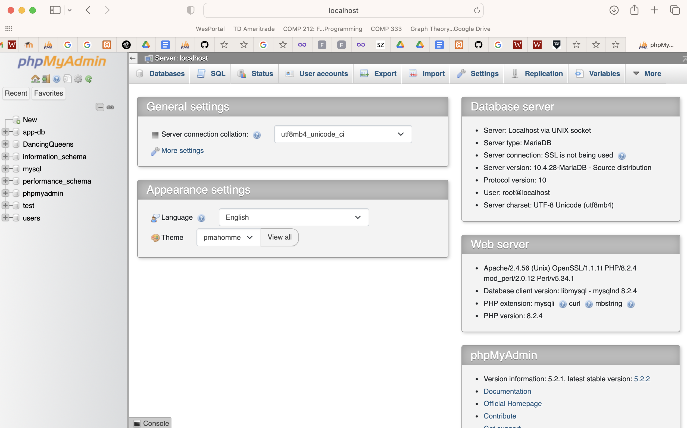
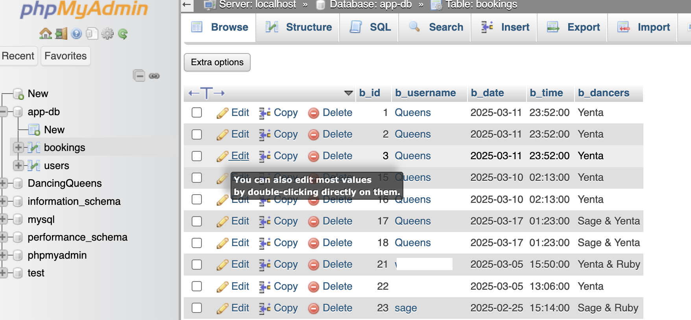

# Dancing-Landing
SWE HW2 Web App 

Team: Ruby, Yenta, Sage

This is a demo web app for Software Engineering.
To view and install the app visit https://thedancingqueens.great-site.net

How to use the different features of our app:
First, create an account using the create account tab in the navbar. From there you can log in to your account and go to your profile using the navbar tab. Now, at your profile you should be able to view bookings of all of the users and what has been already booked (although we allow double booking because we can all split into a million copies of ourselves) this is the READ functionality. From the profile you can CREATE a booking, once created, return to your profile and it will appear in the bookings of all users under your username. Once you have created a booking you can modify or UPDATE your booking using the specific id your booking was given (you can see your booking id for the booking you wish to modify on the your profile tab). You can also choose to DELETE your booking by entering the id of the booking you created. 

In order to run this app locally, download and set up XAMPP, place all files into the htdocs folder (replacing the files there by default), and navigate to localhost:8080/phpmyadmin in your browser. In PHPMyAdmin, create a new database named app-db, and enter the SQL tab.

Once you have a query window, input the following two queries to create the necessary tables:
```
CREATE TABLE users(
	username VARCHAR(255) PRIMARY KEY,
	password VARCHAR(255));

CREATE TABLE bookings (
    b_id INT(11) AUTO_INCREMENT PRIMARY KEY,
    b_username VARCHAR(255),
    b_date DATE,
    b_time TIME,
    b_dancers VARCHAR(18),
    FOREIGN KEY (b_username) REFERENCES users(username) 
);
```
Finally, navigate to localhost:8080/index.php and enjoy!

Ruby's local phpMyAdmin interface
‎

Yenta's local phpMyAdmin interface
‎

Sage had technical difficulties and she went to office hours with the professor, as a result she was not able to set up PHP admin but she still contributed an equivalent share.

Work done was split evenly among all three group members (33.3/33.3/33.3)
 
